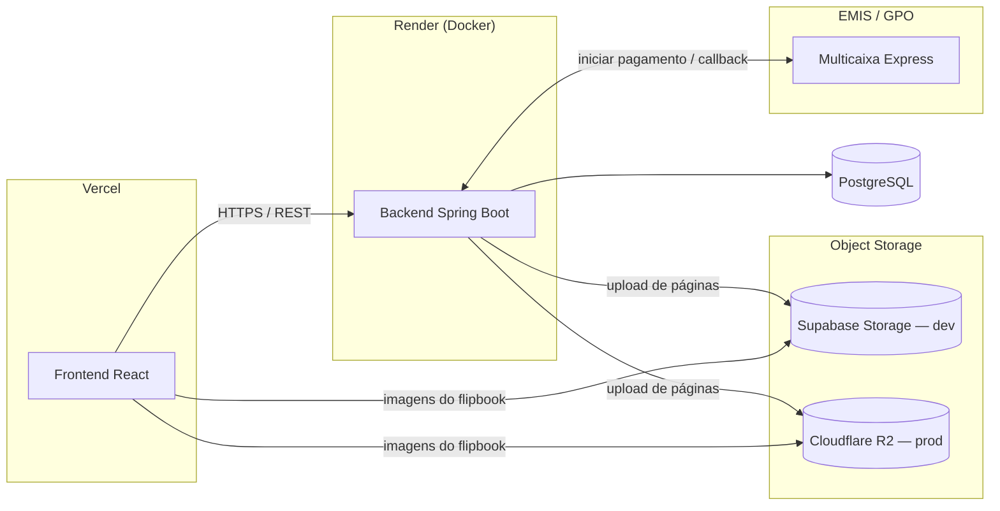

# Infra-estrutura e Deployment — v3 (novo)

> Ver [`00-changelog-v3.md`](../00-changelog-v3.md). Decisões de hospedagem tomadas na reunião de arquitectura final.

## Visão geral

## Frontend — Vercel

- Deploy automático a partir do repositório do frontend.
- Variáveis de ambiente incluem a URL base da API (backend no Render) e as chaves públicas necessárias para aceder directamente ao object storage (se o frontend ler as imagens directamente do Supabase/R2, em vez de sempre passar pelo backend — a confirmar com o colega do frontend, ver nota abaixo).

## Backend — Render, em Docker

- O backend é empacotado num contentor Docker (`Dockerfile` na raiz de `backend/`).
- Variáveis de ambiente (geridas no painel do Render, nunca commitadas): ligação à base de dados PostgreSQL, segredo do JWT, credenciais do object storage (Supabase em dev, R2 em prod), e, mais tarde, credenciais do GPO.
- O Render gere o build a partir do `Dockerfile`; o Flyway corre automaticamente no arranque da aplicação, aplicando migrações pendentes.

## Base de dados — PostgreSQL

- Instância gerida (Render Postgres, Supabase Postgres, ou equivalente — a decidir; não foi especificado em reunião qual dos dois serviços aloja também a base de dados relacional, distinto do object storage).

## Object storage — Supabase (dev) / Cloudflare R2 (prod)

- Implementações da interface `StorageService` (ver [`08-implementation-guides/flipbook-microservice-guide.md`](../08-implementation-guides/flipbook-microservice-guide.md)), seleccionadas por `@Profile("dev")` / `@Profile("prod")`.
- **Ponto a confirmar com o frontend:** se as imagens são servidas sempre através de um endpoint do backend (que por sua vez lê do storage e verifica acesso — como descrito em `04-architecture/security.md`), ou se o frontend acede directamente ao Supabase/R2 com URLs assinadas geradas pelo backend. A primeira opção é mais simples de proteger; a segunda reduz carga no backend, mas exige gerar e expirar URLs assinadas correctamente.

## GPO / EMIS

- Sem infra-estrutura própria — é uma API externa. Ver [`08-implementation-guides/payment-gateway-guide.md`](../08-implementation-guides/payment-gateway-guide.md) para o desenho da integração (actualmente simulada).

## Ambientes

| Ambiente | Frontend | Backend | Storage | Gateway de pagamento |
|----------|----------|---------|---------|------------------------|
| Desenvolvimento | Local / preview da Vercel | Local (Docker Compose) ou preview do Render | Supabase Storage | Simulado (`SimuladoGatewayPagamentoService`) |
| Produção | Vercel | Render | Cloudflare R2 | GPO real (após certificação com a EMIS) |
