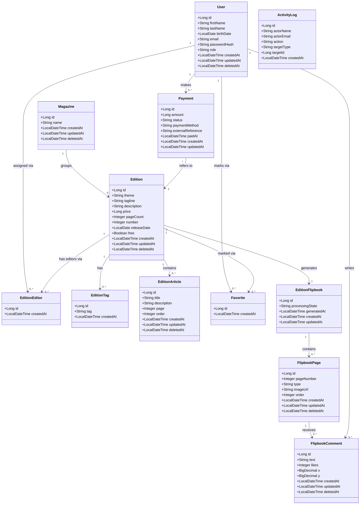

# Diagrama de Classes (UML) — v3 (corrigido)

> Ver [`00-changelog-v3.md`](../00-changelog-v3.md). Nomes de classes e campos em **inglês** (código), com o nome da coluna/tabela em português entre parênteses onde difere — ver [`03-data-model/data-ditionary.md`](../03-data-model/data-ditionary.md) para os nomes reais na base de dados.

## Correspondência classe Java ↔ tabela na base de dados

| Classe (código, EN) | Tabela (BD, PT) |
|---|---|
| `User` | `utilizador` |
| `Magazine` | `revista` |
| `Edition` | `edicao` |
| `Payment` | `pagamento` |
| `EditionEditor` | `editor_edicao` |
| `EditionTag` | `edicao_tag` |
| `EditionArticle` | `edicao_artigo` |
| `Favorite` | `favorito` |
| `ActivityLog` | `log` |
| `EditionFlipbook` | `flipbook_edicao` |
| `FlipbookPage` | `flipbook_pagina` |
| `FlipbookComment` | `flipbook_comentario` |

Cada campo é mapeado individualmente via `@Column(name = "...")` — ver exemplo completo em [`08-implementation-guides/crud-implementation-guide.md`](../08-implementation-guides/crud-implementation-guide.md).
