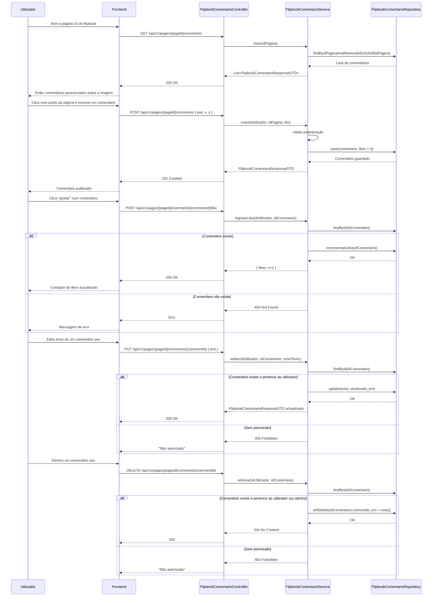

# Diagrama de Sequência – Comentários e Likes — v3

> Ver [`00-changelog-v3.md`](../00-changelog-v3.md). Substitui por completo a versão anterior (que tinha resposta aninhada e dois modelos de comentário). Agora existe apenas `FlipbookComentario`, sem resposta, com `likes`.

## Nota sobre likes duplicados

Este diagrama assume, para simplicidade, um incremento directo em `likes`. Como referido em [`comments-endpoints.md`](../05-api/comments-endpoints.md), impedir que o mesmo utilizador dê like duas vezes requer uma tabela de junção adicional (`flipbook_comentario_like`) — não estava no MER decidido em reunião, fica como proposta a confirmar.
