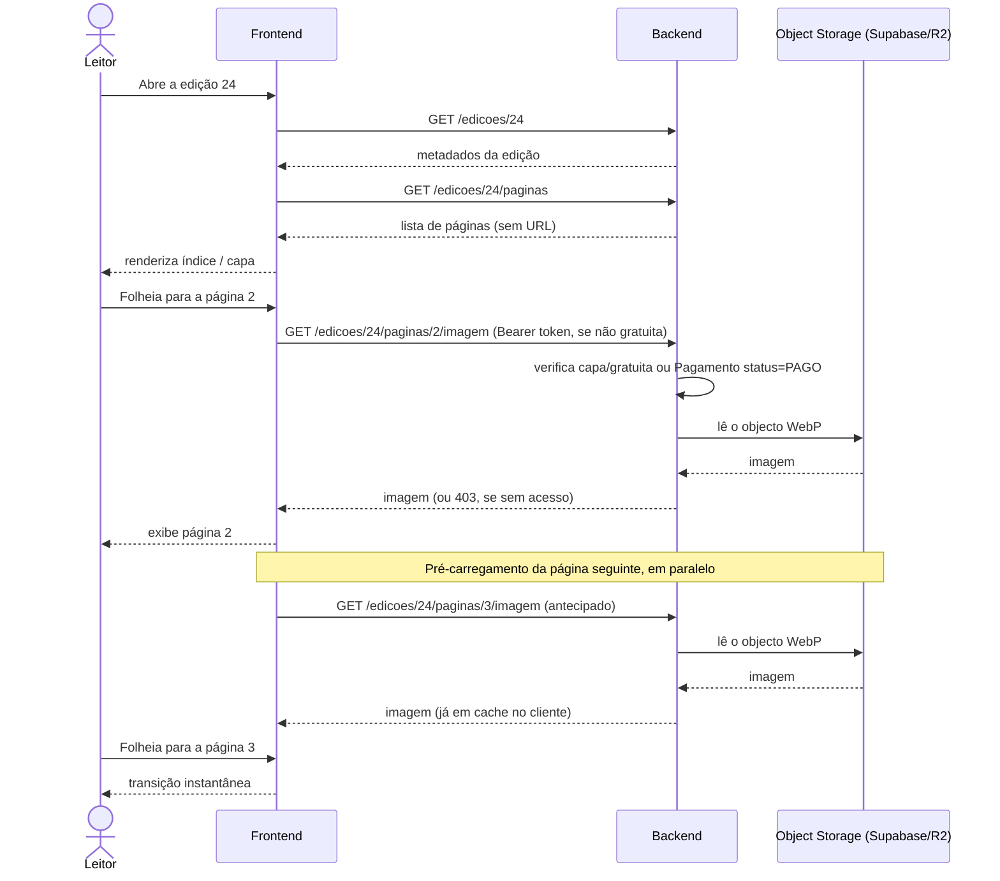
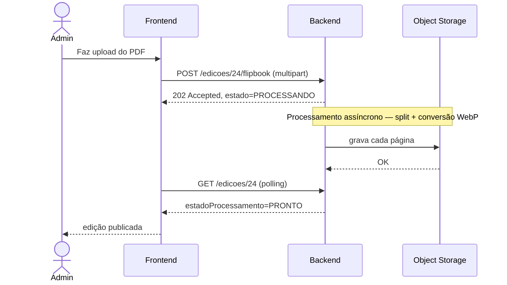

# Diagrama de Sequência — Navegação do Leitor e Carregamento do Flipbook — v3

> Ver [`00-changelog-v3.md`](../00-changelog-v3.md). Diagrama pedido na reunião de arquitectura final: mostra como o utilizador navega entre páginas e como as requisições se distribuem entre Frontend, Backend e Object Storage. **Corrigido para Mermaid.**

## Abertura de uma edição e navegação entre páginas

## Nota de desenho

Este diagrama assume que **todas as imagens passam pelo backend**, que valida o acesso a cada pedido — a opção mais simples de proteger, descrita como recomendação em [`04-architecture/deployment.md`](../04-architecture/deployment.md). Se se optar por URLs assinadas consumidas directamente pelo frontend a partir do Supabase/R2, o passo "lê o objecto WebP" passaria a ser uma resposta do backend com uma URL temporária, seguida de um pedido directo do Frontend ao Object Storage. **Este ponto ainda não foi decidido — fica para confirmar com o colega do frontend.**

## Upload e processamento (contexto — ver guia dedicado)

Ver [`08-implementation-guides/flipbook-microservice-guide.md`](../08-implementation-guides/flipbook-microservice-guide.md) para a implementação.
