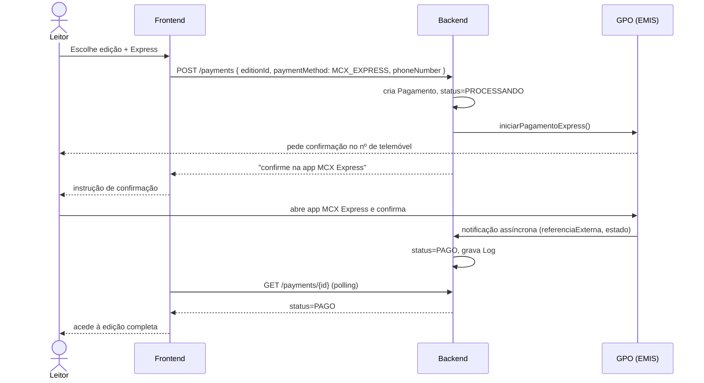
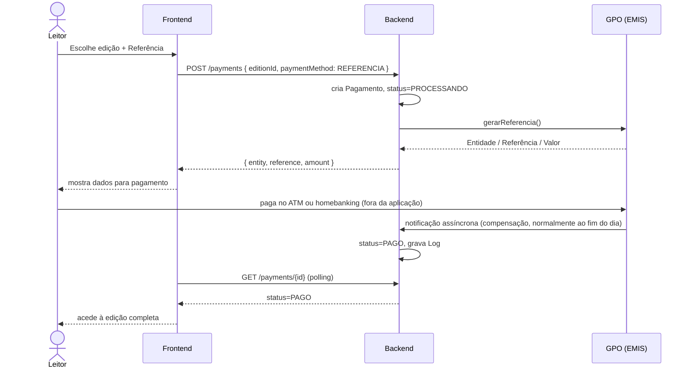
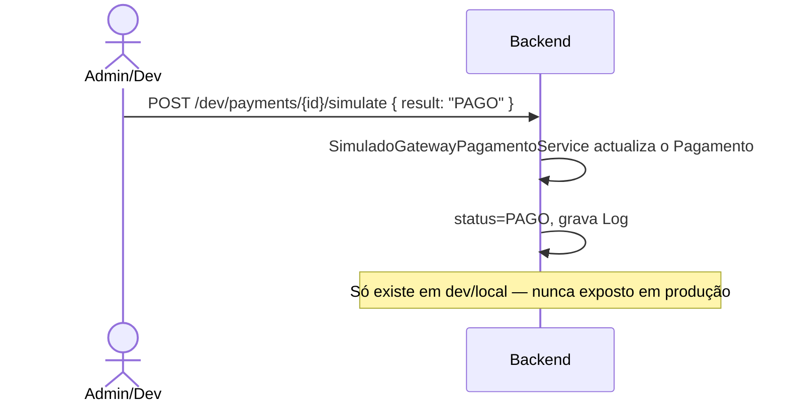
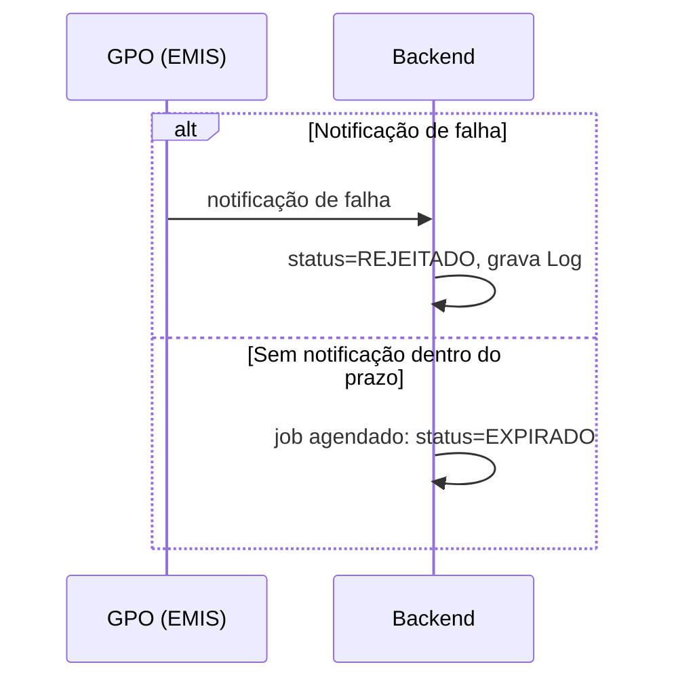

# Diagrama de Sequência — Pagamento — v3

> Ver [`00-changelog-v3.md`](../00-changelog-v3.md) e [`04-architecture/security.md`](../04-architecture/security.md). **Corrigido para Mermaid** (linguagem obrigatória para todos os diagramas desta documentação).

## Fluxo — Multicaixa Express (confirmação por telemóvel)

## Fluxo — Referência (ATM / homebanking)

## Variante em desenvolvimento — gateway simulado

## Fluxo de falha ou expiração

Ver [`08-implementation-guides/payment-gateway-guide.md`](../08-implementation-guides/payment-gateway-guide.md) para a implementação simulada.
