# Diagrama de Casos de Uso — v3

> Ver [`00-changelog-v3.md`](../00-changelog-v3.md). Actualizado para o modelo de comentário único (sem resposta), pagamento via GPO, favoritos e atribuição de editores.

```mermaid
flowchart TD
    subgraph Atores
        L[Leitor]
        A[Administrador]
        V["Visitante (não autenticado)"]
    end

    subgraph Casos de Uso
        UC1["Registar-se no sistema"]
        UC2["Fazer login"]
        UC3["Visualizar amostra da edição (capa / edição gratuita)"]
        UC4["Comprar edição via Multicaixa Express"]
        UC5["Visualizar edição completa"]
        UC6["Comentar numa página do flipbook"]
        UC7["Dar like num comentário"]
        UC8["Editar/eliminar próprio comentário"]
        UC9["Marcar/desmarcar edição como favorita"]
        UC10["Ver histórico de compras"]
        UC11["Gerir perfil"]
        UC12["Publicar nova revista/edição"]
        UC13["Editar metadados de edição"]
        UC14["Eliminar edição (soft delete)"]
        UC15["Fazer upload do PDF e gerar flipbook"]
        UC16["Atribuir utilizador como editor de uma edição"]
        UC17["Acompanhar pagamentos"]
        UC18["Moderar comentários (eliminar qualquer um)"]
        UC19["Consultar logs de actividade"]
    end

    V --> UC1
    V --> UC2
    V --> UC3

    L --> UC4
    L --> UC5
    L --> UC6
    L --> UC7
    L --> UC8
    L --> UC9
    L --> UC10
    L --> UC11

    A --> UC12
    A --> UC13
    A --> UC14
    A --> UC15
    A --> UC16
    A --> UC17
    A --> UC18
    A --> UC19

    UC4 -.->|"include (após status = PAGO)"| UC5
    UC12 -.->|"include"| UC15
```

